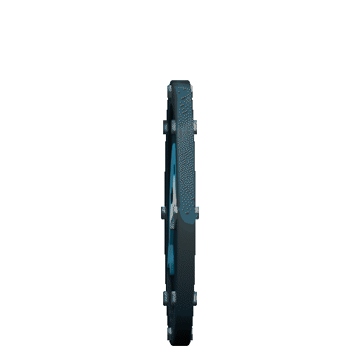

  
  
  
  

### About me:
---

I'm a software engineer and creative idealist based out of Jeonju, South Korea; born and raised in Tulsa, Oklahoma, USA.
  
I have 5 years of hobby experience and an additional 7 years of professional experience working in a variety of software development roles including, but not limited to, mobile app, backend, internal tools, virtual reality, and Blender plugin development. I love to try out new technologies and expose myself to ideas from a range of different disciplines to incorporate into my work!
  
I do what I do for the good of all beings, because we are better off together than apart. To learn, to grow, to create, to endure, and to thrive. Though there is much work to be done and much we don't understand, one thing is certain: "Blessed are those who plant trees under whose shade they will never sit".

---
### Top Tech:

  
  
  
  
  
  
  

---

  Best of luck to you and
   
  ☁️ <b>Happy Coding!</b> ☁️

